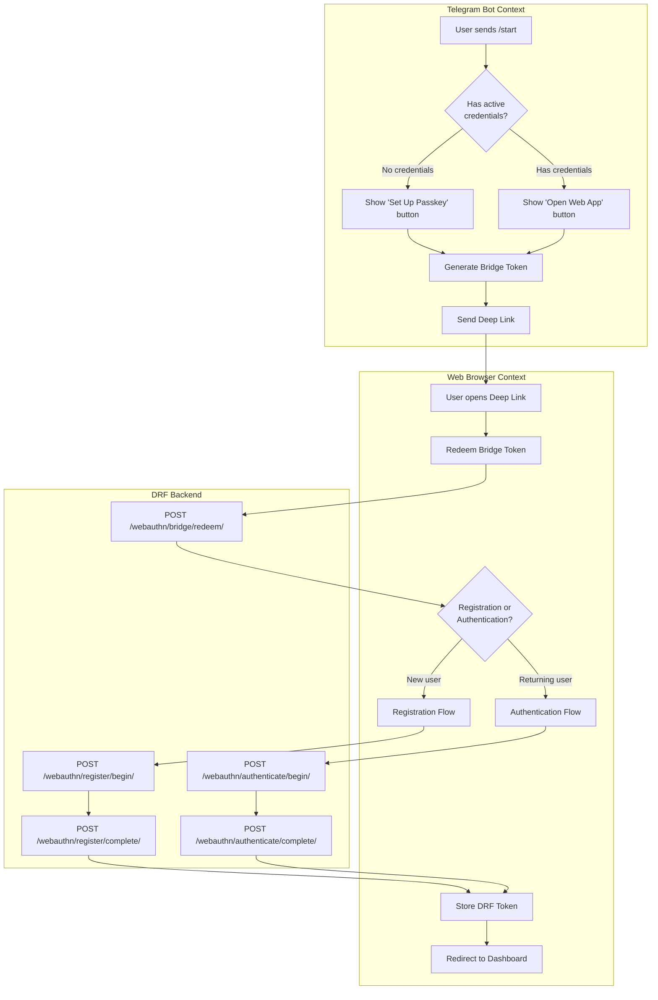
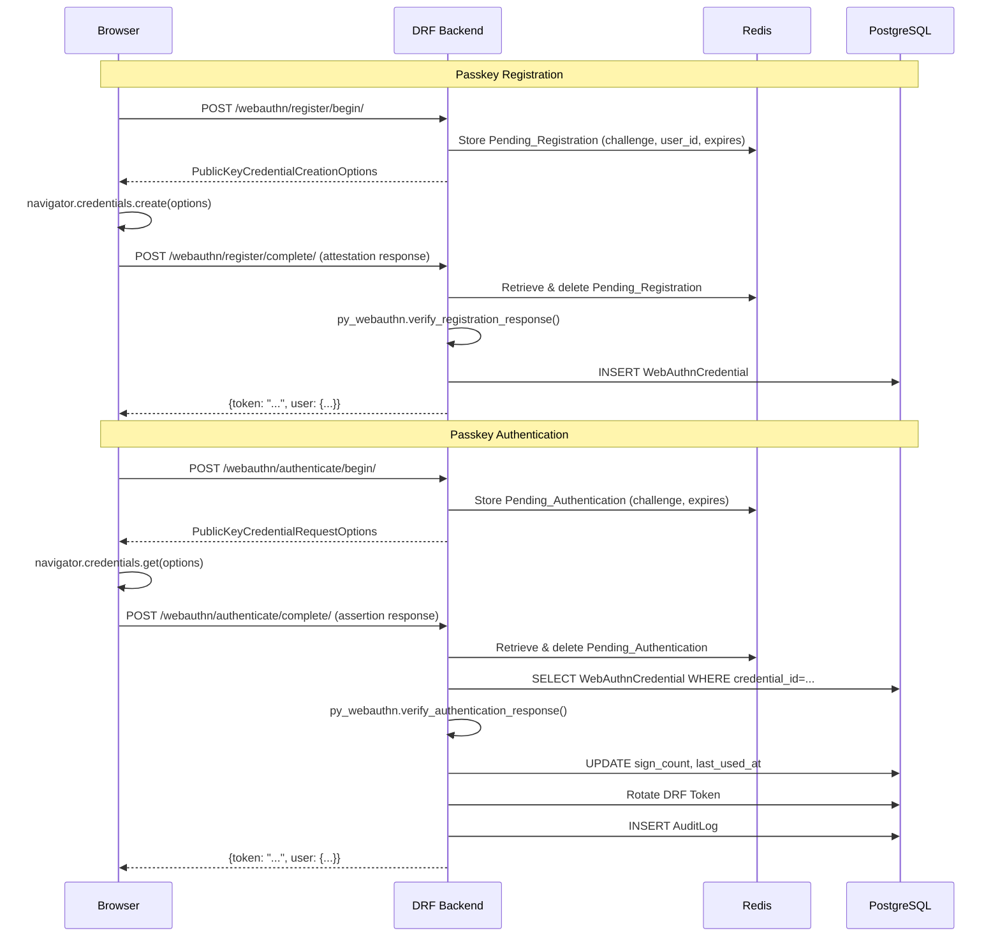

# Design Document: Unified Authentication with Passkeys

## Overview

This document describes the technical design for integrating WebAuthn (Passkeys) into the existing Telegram-based authentication system. The goal is a unified auth system where Telegram identity bootstraps the first Passkey registration, and thereafter the Passkey becomes the primary credential for web sessions — eliminating repeated Telegram login prompts.

### Key Design Decisions

**py_webauthn as the backend WebAuthn library.** The `webauthn` package (PyPI: `webauthn`, GitHub: `duo-labs/py_webauthn`) is the most widely adopted Python WebAuthn server library. It handles CBOR parsing, COSE key decoding, attestation verification, and sign-count validation. It is actively maintained and supports the full WebAuthn Level 2 spec.

**@simplewebauthn/browser as the frontend WebAuthn library.** This TypeScript library wraps the browser's `navigator.credentials` API with a clean, typed interface. It handles base64url encoding/decoding, platform authenticator detection, and the two-round-trip ceremony (begin → complete) for both registration and authentication.

**Bridge Token as a signed JWT-like payload.** Rather than a full JWT library, the Bridge Token is a simple HMAC-SHA256 signed payload (base64url-encoded JSON + signature) using Django's `SECRET_KEY`. This avoids adding a JWT dependency and keeps the implementation transparent.

**Pending challenges stored in Django cache (Redis).** Registration and authentication challenges are short-lived (5 minutes) and do not need to survive server restarts. Redis (already in the stack) is the natural store. This avoids a database migration for ephemeral data.

**WebAuthn_Credential as a dedicated Django model.** The existing `webauthn_credentials` JSON field on `User` is replaced by a normalized `WebAuthnCredential` model. This enables per-credential revocation, audit, and rename without JSON manipulation.

---

## Architecture

The system has three interaction contexts:

1. **Telegram Bot Context** — user interacts with the Python Telegram bot. The bot generates a Bridge Token and sends a Deep Link to the browser.
2. **Web Browser Context** — user interacts with the Next.js frontend. The frontend calls the DRF backend for WebAuthn ceremonies and receives/stores a DRF Token.
3. **Backend (DRF)** — handles all cryptographic operations, challenge issuance, verification, token management, and credential storage.



### Authentication Flow Diagram



---

## Components and Interfaces

### Backend Components

#### 1. `WebAuthnCredential` Model (`backend/apps/users/models.py`)

New Django model replacing the `webauthn_credentials` JSON field on `User`.

```python
class WebAuthnCredential(models.Model):
    id = models.UUIDField(primary_key=True, default=uuid.uuid4, editable=False)
    user = models.ForeignKey(
        settings.AUTH_USER_MODEL,
        on_delete=models.CASCADE,
        related_name='webauthn_credentials_set'
    )
    credential_id = models.BinaryField(unique=True, db_index=True)
    public_key = models.BinaryField()
    sign_count = models.PositiveIntegerField(default=0)
    device_name = models.CharField(max_length=100, blank=True, null=True)
    aaguid = models.UUIDField(blank=True, null=True)
    created_at = models.DateTimeField(auto_now_add=True)
    last_used_at = models.DateTimeField(null=True, blank=True)
    is_active = models.BooleanField(default=True)
```

#### 2. `WebAuthnService` (`backend/apps/users/webauthn_service.py`)

Encapsulates all WebAuthn ceremony logic. Depends on `py_webauthn` and Django cache.

Key methods:
- `generate_registration_options(user) -> PublicKeyCredentialCreationOptions`
- `verify_registration_response(user, response) -> WebAuthnCredential`
- `generate_authentication_options() -> PublicKeyCredentialRequestOptions`
- `verify_authentication_response(response) -> (User, WebAuthnCredential)`

#### 3. `BridgeTokenService` (`backend/apps/users/bridge_token.py`)

Handles Bridge Token generation, signing, and redemption.

Key methods:
- `generate(user, flow: Literal['register', 'authenticate']) -> str`
- `redeem(token: str) -> (User, flow)`

Token format: `base64url(json_payload) + "." + base64url(hmac_sha256_signature)`

#### 4. WebAuthn Views (`backend/apps/users/views_webauthn.py`)

New view module with all WebAuthn endpoints. Uses `@permission_classes([AllowAny])` for challenge endpoints (unauthenticated users need to authenticate) and `@permission_classes([IsAuthenticated])` for registration begin (must be logged in to register a new key).

#### 5. Credential Management Views (added to `UserViewSet`)

New actions on the existing `UserViewSet`:
- `GET /credentials/` → `list_credentials`
- `PATCH /credentials/{id}/` → `rename_credential`
- `DELETE /credentials/{id}/` → `revoke_credential`

#### 6. Updated `TelegramAuthentication` / `telegram_login` view

The `telegram_login` view is updated to return `passkey_setup_required: true` when the authenticated user has no active `WebAuthnCredential` records.

#### 7. Updated Telegram Bot (`backend/apps/telegram_bot/bot.py`)

The `start_command` handler is updated to:
- Check for active `WebAuthnCredential` records
- Show "Set Up Passkey" button (with Bridge Token Deep Link) if none exist
- Show "Open Web App" button (with Bridge Token Deep Link for auth flow) if credentials exist

### Frontend Components

#### 1. `lib/webauthn.ts`

TypeScript module wrapping `@simplewebauthn/browser`:
- `startPasskeyRegistration(options)` — calls `startRegistration()`
- `startPasskeyAuthentication(options)` — calls `startAuthentication()`

#### 2. `app/auth/passkey-setup/page.tsx`

Page component for the Passkey registration flow. Handles:
- Bridge Token redemption (if arriving from Deep Link)
- Calling `register/begin` and `register/complete`
- Redirecting to dashboard on success

#### 3. `app/login/page.tsx` (updated)

Updated login page:
- Checks for existing valid session token → redirect to dashboard
- Shows "Sign in with Passkey" as primary button
- Shows Telegram Login Widget as secondary option
- Handles `passkey_setup_required: true` response from Telegram login

#### 4. `store/auth.ts` (updated)

Zustand store updated to handle:
- `passkeySetupRequired` flag
- Token rotation after Passkey authentication

#### 5. `components/auth/PasskeyButton.tsx`

Reusable button component that triggers the Passkey authentication flow.

#### 6. `components/auth/CredentialManager.tsx`

Component for listing, renaming, and revoking credentials (used in profile settings).

---

## Data Models

### `WebAuthnCredential` (new table: `webauthn_credentials`)

| Field | Type | Constraints | Notes |
|---|---|---|---|
| `id` | UUID | PK, default uuid4 | |
| `user` | FK → User | CASCADE, indexed | |
| `credential_id` | BinaryField | UNIQUE, indexed | Raw bytes from authenticator |
| `public_key` | BinaryField | NOT NULL | COSE-encoded public key bytes |
| `sign_count` | PositiveInteger | default=0 | Monotonically increasing counter |
| `device_name` | VARCHAR(100) | nullable | User-supplied label |
| `aaguid` | UUID | nullable | Authenticator model identifier |
| `created_at` | DateTime | auto_now_add | |
| `last_used_at` | DateTime | nullable | Updated on each successful auth |
| `is_active` | Boolean | default=True | False = revoked |

### `PendingRegistration` (Redis key, not a DB table)

Stored in Redis with key `webauthn:pending_reg:{user_id}`:

```json
{
  "challenge": "<base64url bytes>",
  "user_id": "<uuid string>",
  "created_at": "<iso8601 timestamp>"
}
```

TTL: 300 seconds (5 minutes).

### `PendingAuthentication` (Redis key, not a DB table)

Stored in Redis with key `webauthn:pending_auth:{challenge_b64}`:

```json
{
  "challenge": "<base64url bytes>",
  "created_at": "<iso8601 timestamp>"
}
```

TTL: 300 seconds (5 minutes). Keyed by challenge (not user) because the user is unknown at challenge-request time (discoverable credentials).

### `ConsumedBridgeToken` (Redis key, not a DB table)

Stored in Redis with key `webauthn:bridge_used:{token_hash}`:

Value: `"1"`, TTL: 600 seconds (10 minutes, matching Bridge Token expiry).

### Bridge Token Payload

```json
{
  "telegram_id": 123456789,
  "user_id": "uuid-string",
  "flow": "register" | "authenticate",
  "issued_at": 1700000000,
  "expires_at": 1700000600
}
```

Serialized as: `base64url(json) + "." + base64url(hmac_sha256(SECRET_KEY, base64url(json)))`

### Updated `User` Model

The `webauthn_credentials` JSONField on `User` is **deprecated** (kept for migration compatibility, not used by new code). New code reads from `WebAuthnCredential` model.

### DRF Token Lifecycle

The existing `Token` model is used. The `create_auth_token` function in `tokens.py` already handles 30-day rotation. The `verify_authentication_response` path calls `revoke_auth_token` then `create_auth_token` to enforce token rotation on each Passkey login.

---

## API Endpoint Reference

All new endpoints are under `/api/v1/users/`:

| Method | Path | Auth Required | Description |
|---|---|---|---|
| `POST` | `auth/webauthn/register/begin/` | Yes (Token or Telegram) | Issue registration challenge |
| `POST` | `auth/webauthn/register/complete/` | Yes (Token or Telegram) | Verify registration response |
| `POST` | `auth/webauthn/authenticate/begin/` | No | Issue authentication challenge |
| `POST` | `auth/webauthn/authenticate/complete/` | No | Verify assertion, issue token |
| `POST` | `auth/webauthn/bridge/redeem/` | No | Redeem Bridge Token |
| `GET` | `credentials/` | Yes | List user's credentials |
| `PATCH` | `credentials/{id}/` | Yes | Rename a credential |
| `DELETE` | `credentials/{id}/` | Yes | Revoke a credential |

### Request/Response Schemas

**`POST /auth/webauthn/register/begin/`**
- Request: `{ "device_name": "MacBook Touch ID" }` (optional)
- Response: `PublicKeyCredentialCreationOptions` (JSON, base64url-encoded binary fields)

**`POST /auth/webauthn/register/complete/`**
- Request: `{ "credential": <AttestationResponse JSON>, "device_name": "..." }`
- Response: `{ "token": "...", "user": {...} }`

**`POST /auth/webauthn/authenticate/begin/`**
- Request: `{}` (no body required)
- Response: `PublicKeyCredentialRequestOptions` (JSON, base64url-encoded binary fields)

**`POST /auth/webauthn/authenticate/complete/`**
- Request: `{ "credential": <AssertionResponse JSON> }`
- Response: `{ "token": "...", "user": {...} }`

**`POST /auth/webauthn/bridge/redeem/`**
- Request: `{ "bridge_token": "..." }`
- Response: `{ "flow": "register" | "authenticate", "user": {...}, "token": "..." | null }`
  - For `register` flow: returns a temporary session token for the registration ceremony
  - For `authenticate` flow: initiates the authentication ceremony (returns options)

**`GET /credentials/`**
- Response: `[{ "id": "...", "device_name": "...", "aaguid": "...", "created_at": "...", "last_used_at": "...", "is_active": true }]`

**`PATCH /credentials/{id}/`**
- Request: `{ "device_name": "New Name" }`
- Response: Updated credential object

**`DELETE /credentials/{id}/`**
- Response: `204 No Content` or `400` if last active credential

---

## Correctness Properties

*A property is a characteristic or behavior that should hold true across all valid executions of a system — essentially, a formal statement about what the system should do. Properties serve as the bridge between human-readable specifications and machine-verifiable correctness guarantees.*

### Property 1: Base64url Round-Trip

*For any* byte sequence of any length, encoding it with base64url and then decoding the result SHALL produce the original byte sequence.

**Validates: Requirements 15.3**

### Property 2: Challenge Uniqueness and Minimum Length

*For any* two consecutive calls to the challenge generation function (for registration or authentication), the two challenges SHALL be distinct, and each SHALL have a byte length of at least 32.

**Validates: Requirements 3.1, 5.1**

### Property 3: Pending Registration Replacement

*For any* authenticated user, calling `register/begin` twice in succession SHALL result in exactly one `Pending_Registration` record in the cache for that user (the second call replaces the first).

**Validates: Requirements 3.5**

### Property 4: Registration Options Structure

*For any* authenticated user, the `PublicKeyCredentialCreationOptions` returned by `register/begin` SHALL contain all required fields: `challenge` (base64url string, ≥ 32 bytes decoded), `rp.id`, `rp.name`, `user.id`, `user.name`, `pubKeyCredParams` (containing ES256 and RS256), `timeout`, `attestation`, and `authenticatorSelection`.

**Validates: Requirements 3.4**

### Property 5: Authentication Options Structure

*For any* call to `authenticate/begin`, the `PublicKeyCredentialRequestOptions` returned SHALL contain all required fields: `challenge` (base64url string, ≥ 32 bytes decoded), `timeout`, `rpId`, `userVerification`, and `allowCredentials` (empty list).

**Validates: Requirements 5.3**

### Property 6: Credential Uniqueness Constraint

*For any* two distinct users, attempting to store a `WebAuthnCredential` with the same `credential_id` for the second user SHALL raise a database integrity error.

**Validates: Requirements 1.2**

### Property 7: Sign Count Anti-Cloning

*For any* `WebAuthnCredential` with a stored `sign_count` S > 0, presenting an authentication assertion with a reported `sign_count` ≤ S SHALL be rejected with a 401 error.

**Validates: Requirements 6.4**

### Property 8: Credential Ownership Isolation

*For any* two distinct users A and B, user B SHALL NOT be able to rename or revoke a credential belonging to user A (SHALL receive a 403 error).

**Validates: Requirements 11.3**

### Property 9: Last Credential Protection

*For any* user with exactly one active `WebAuthnCredential`, attempting to revoke that credential SHALL return an error and the credential SHALL remain active.

**Validates: Requirements 11.5**

### Property 10: Revoked Credential Rejection

*For any* `WebAuthnCredential` with `is_active = false`, presenting it during an authentication ceremony SHALL be rejected with a 401 error.

**Validates: Requirements 11.6**

### Property 11: Bridge Token Integrity

*For any* generated Bridge Token, modifying any byte of the payload or signature portion SHALL cause signature verification to fail and the token SHALL be rejected.

**Validates: Requirements 13.1, 13.5**

### Property 12: Bridge Token Single-Use

*For any* valid Bridge Token, redeeming it a second time SHALL return a 401 error, regardless of whether the token is still within its expiry window.

**Validates: Requirements 13.3**

### Property 13: Token Rotation on Passkey Login

*For any* user with an existing DRF Token T1, after a successful Passkey authentication, the response SHALL contain a new token T2 where T2 ≠ T1, and T1 SHALL be invalid for subsequent API requests.

**Validates: Requirements 12.3**

### Property 14: Token Invalidation on Logout

*For any* valid DRF Token, after the user calls the logout endpoint, using that token for any authenticated API request SHALL return a 401 error.

**Validates: Requirements 12.4**

### Property 15: Passkey Setup Required Flag

*For any* user with zero active `WebAuthnCredential` records, a successful Telegram login response SHALL include `passkey_setup_required: true`.

**Validates: Requirements 9.3**

### Property 16: Credential List Completeness

*For any* user with N active `WebAuthnCredential` records, the `GET /credentials/` endpoint SHALL return exactly N records, each containing `id`, `device_name`, `aaguid`, `created_at`, `last_used_at`, and `is_active`.

**Validates: Requirements 11.1**

### Property 17: Audit Log on Passkey Authentication

*For any* successful Passkey authentication, an `AuditLog` record SHALL exist with `action = 'LOGIN'`, `user` set to the authenticated user, and `details` containing the `credential_id`.

**Validates: Requirements 12.5**

---

## Error Handling

### Backend Error Responses

All error responses follow the existing DRF convention: `{ "error": "...", "detail": "..." }`.

| Scenario | HTTP Status | Error Message |
|---|---|---|
| Missing/invalid Telegram auth | 401 | "Authentication failed" |
| Expired registration challenge | 400 | "Registration challenge expired" |
| WebAuthn verification failure | 400 | "WebAuthn verification failed: {detail}" |
| Unknown credential_id | 401 | "Credential not found" |
| Revoked credential | 401 | "Credential has been revoked" |
| Sign count mismatch (cloned) | 401 | "Authenticator sign count invalid — possible cloned authenticator" |
| Expired authentication challenge | 401 | "Authentication challenge expired" |
| Invalid Bridge Token signature | 401 | "Invalid bridge token" |
| Expired Bridge Token | 401 | "Bridge token has expired" |
| Already-consumed Bridge Token | 401 | "Bridge token has already been used" |
| Credential not owned by user | 403 | "Credential not found" (intentionally vague) |
| Revoking last credential | 400 | "Cannot revoke last active credential" |
| Malformed base64url | 400 | "Invalid base64url encoding" |
| Missing WEBAUTHN_RP_ID config | 500 (startup) | ImproperlyConfigured raised at startup |

### Frontend Error Handling

- WebAuthn API errors (e.g., user cancels, no authenticator) are caught and displayed as toast notifications.
- Network errors during ceremonies show a retry option.
- Bridge Token errors redirect to `/login?error=bridge_token_invalid`.
- `passkey_setup_required: true` triggers a redirect to `/auth/passkey-setup` with the temporary token stored in session storage (not localStorage, to avoid persistence across tabs).

### Graceful Degradation

- If the browser does not support WebAuthn (`!window.PublicKeyCredential`), the "Sign in with Passkey" button is hidden and only the Telegram Login Widget is shown.
- If a user has no active credentials and their Telegram session expires, they can re-authenticate via Telegram and will be prompted to set up a Passkey again.

---

## Testing Strategy

### Unit Tests (pytest + factory_boy)

Focus on specific examples, edge cases, and error conditions:

- `WebAuthnCredential` model field validation and constraints
- `BridgeTokenService.generate()` and `BridgeTokenService.redeem()` with valid/invalid/expired tokens
- `WebAuthnService` challenge generation (length, uniqueness)
- `telegram_login` view returning `passkey_setup_required: true` for users with no credentials
- Credential management views: rename, revoke, last-credential protection
- Token rotation: old token invalid after Passkey login
- Audit log creation on Passkey authentication
- Rate limiting: 11th request to challenge endpoint returns 429
- Configuration error when `WEBAUTHN_RP_ID` is missing

### Property-Based Tests (Hypothesis)

The project uses Python/pytest on the backend. The property-based testing library is **Hypothesis** (already compatible with pytest-django).

Each property test runs a minimum of 100 iterations. Tests are tagged with a comment referencing the design property.

**Feature: unified-auth-passkeys**

```python
# Feature: unified-auth-passkeys, Property 1: Base64url Round-Trip
@given(st.binary(min_size=0, max_size=1024))
def test_base64url_round_trip(data):
    assert base64url_decode(base64url_encode(data)) == data

# Feature: unified-auth-passkeys, Property 2: Challenge Uniqueness and Minimum Length
@given(st.integers(min_value=1, max_value=10))
def test_challenge_uniqueness_and_length(n):
    challenges = [generate_challenge() for _ in range(n)]
    assert all(len(c) >= 32 for c in challenges)
    assert len(set(challenges)) == len(challenges)  # all unique

# Feature: unified-auth-passkeys, Property 7: Sign Count Anti-Cloning
@given(st.integers(min_value=1, max_value=10000))
def test_sign_count_anti_cloning(stored_sign_count):
    # Any assertion with sign_count <= stored should be rejected
    ...

# Feature: unified-auth-passkeys, Property 11: Bridge Token Integrity
@given(st.binary(min_size=1, max_size=100))
def test_bridge_token_tamper_detection(tamper_bytes):
    token = BridgeTokenService.generate(user, 'register')
    tampered = tamper_token(token, tamper_bytes)
    with pytest.raises(InvalidBridgeToken):
        BridgeTokenService.redeem(tampered)
```

### Integration Tests

- Full registration ceremony (mocked authenticator response using py_webauthn test utilities)
- Full authentication ceremony (mocked authenticator response)
- Bridge Token → registration flow end-to-end
- Bridge Token → authentication flow end-to-end
- Telegram login → `passkey_setup_required` → registration → dashboard redirect

### Frontend Tests

The frontend uses the existing Next.js/TypeScript setup. Tests use **Vitest** + **React Testing Library** (to be added as dev dependencies).

- `PasskeyButton` component: renders correctly, calls `startAuthentication` on click
- `CredentialManager` component: lists credentials, rename/revoke interactions
- Login page: shows Passkey button when WebAuthn is supported, hides it when not
- `lib/webauthn.ts`: unit tests for the wrapper functions

### Security-Specific Tests

- Verify that `credential_id` uniqueness constraint is enforced at the database level
- Verify that Bridge Tokens cannot be replayed (second redemption returns 401)
- Verify that expired challenges are rejected
- Verify that a user cannot access another user's credentials (403)
- Verify that the private key is never stored (only public key bytes in `WebAuthnCredential.public_key`)
